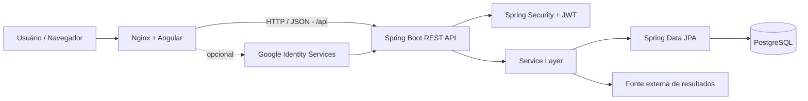

# ☘️ SorteLoto

> Plataforma full-stack para estudo e visualização estatística de concursos da Mega-Sena e Lotofácil, com geração de combinações, SmartScore, histórico, autenticação e sincronização de resultados.


## Sobre o projeto

O **SorteLoto** nasceu como um projeto de portfólio para aplicar conceitos de engenharia de software em uma aplicação completa. O sistema reúne frontend web responsivo, API REST, autenticação JWT, login com Google, persistência relacional, integração externa, análise estatística e containerização.

O objetivo não é prever resultados de loterias. O SmartScore e as análises usam dados históricos apenas para fins **educacionais, estatísticos e recreativos**. Sorteios continuam sendo eventos aleatórios e nenhuma combinação recebe garantia ou aumento comprovado de chance de premiação.

## Principais funcionalidades

- Dashboard responsivo para **Mega-Sena** e **Lotofácil**.
- Geração de combinações e análise estrutural dos jogos.
- **SmartScore** para classificar características estatísticas de uma combinação.
- Frequência, atraso, pares/ímpares, soma e outras métricas.
- Histórico de concursos armazenados no PostgreSQL com paginação e busca por concurso.
- Jogos salvos, favoritos, ranking e conferência.
- Cadastro e login local com senha protegida por **BCrypt**.
- Autenticação stateless com **JWT**.
- Login opcional com **Google Identity Services**.
- Perfil do usuário.
- Área administrativa para sincronização/importação de concursos.
- Estado da base: atualizada, pendente, fonte indisponível ou nunca sincronizada.
- Docker Compose para frontend, backend e PostgreSQL.
- GitHub Actions para validar build/testes em push e pull request.

## Arquitetura

O SorteLoto utiliza uma arquitetura web em camadas. O Angular nunca acessa o banco diretamente: toda comunicação de negócio passa pela **API REST Spring Boot**.



### Responsabilidades

| Camada | Tecnologia | Responsabilidade |
|---|---|---|
| Frontend | Angular 19 | Interface, navegação, gráficos e consumo da API |
| Web server | Nginx | Serve o SPA e faz proxy de `/api` para o backend |
| API | Spring Boot 3.5 | Endpoints REST e orquestração da aplicação |
| Segurança | Spring Security + JWT + BCrypt | Autenticação, autorização e proteção de credenciais |
| Regras de negócio | Services Java | Geração, análise, SmartScore, histórico e sincronização |
| Persistência | Spring Data JPA | Mapeamento e acesso aos dados |
| Banco | PostgreSQL 16 | Usuários, concursos, jogos e estado de sincronização |
| Infraestrutura | Docker Compose | Execução padronizada dos três serviços |

Para uma visão mais detalhada, veja [`docs/ARCHITECTURE.md`](docs/ARCHITECTURE.md).

## API REST

Exemplos dos principais recursos:

| Método | Endpoint | Descrição | Acesso |
|---|---|---|---|
| `POST` | `/api/auth/register` | Cadastro local | Público |
| `POST` | `/api/auth/login` | Login e emissão de JWT | Público |
| `POST` | `/api/auth/google` | Login por token Google | Público |
| `GET` | `/api/games/mega-sena` | Gera jogo Mega-Sena | Público |
| `GET` | `/api/games/lotofacil` | Gera jogo Lotofácil | Público |
| `POST` | `/api/analysis` | Analisa uma combinação | Público |
| `GET` | `/api/stats/{type}` | Estatísticas de uma modalidade | Público |
| `GET` | `/api/draws/{type}` | Histórico paginado | Público |
| `GET` | `/api/profile/me` | Perfil autenticado | JWT |
| `GET` | `/api/saved-games` | Jogos do usuário | JWT |
| `POST` | `/api/import/{type}/sync` | Sincroniza concursos | ADMIN |

A lista ampliada está em [`docs/API.md`](docs/API.md).

## Estrutura do repositório

```text
SorteLoto/
├── backend/                 # API Java / Spring Boot
│   └── src/main/java/
│       └── br/com/smartloto/
│           ├── config/
│           ├── controller/
│           ├── domain/
│           ├── dto/
│           ├── repository/
│           ├── security/
│           └── service/
├── frontend/                # SPA Angular
│   └── src/
├── docs/
│   ├── API.md
│   └── ARCHITECTURE.md
├── docker-compose.yml
├── .env.example
└── README.md
```

## Executando localmente com Docker

### Pré-requisitos

- Docker Desktop ou Docker Engine + Compose.
- Git.
- Para login Google: um OAuth Client ID Web configurado no Google Cloud.

### 1. Clone o projeto

```bash
git clone <URL-DO-SEU-REPOSITORIO>
cd SorteLoto
```

### 2. Crie o arquivo `.env`

No Windows PowerShell:

```powershell
Copy-Item .env.example .env
```

Linux/macOS:

```bash
cp .env.example .env
```

Edite o `.env` e defina pelo menos:

```env
POSTGRES_PASSWORD=uma-senha-forte
SMARTLOTO_JWT_SECRET=uma-chave-longa-aleatoria-com-pelo-menos-32-caracteres
```

O arquivo `.env` está no `.gitignore` e **não deve ser enviado ao GitHub**.

### 3. Suba os containers

```bash
docker compose up --build -d
```

Depois acesse a aplicação em `http://localhost:8088`.

### Admin local opcional

Para habilitar o bootstrap de um administrador em desenvolvimento:

```env
SMARTLOTO_ADMIN_ENABLED=true
SMARTLOTO_ADMIN_EMAIL=admin@smartloto.local
SMARTLOTO_ADMIN_PASSWORD=defina-uma-senha-forte
SMARTLOTO_ADMIN_SYNC_ON_START=false
```

Não publique uma senha real no repositório.

### Google Login opcional

Configure no `.env`:

```env
GOOGLE_CLIENT_ID=seu-client-id.apps.googleusercontent.com
```

Para desenvolvimento local, adicione `http://localhost:8088` aos **Authorized JavaScript origins** do cliente OAuth Web.

## Segurança

- Senhas locais são armazenadas com BCrypt.
- A API utiliza JWT stateless.
- Endpoints administrativos exigem role `ADMIN`.
- Segredos são recebidos por variáveis de ambiente.
- `.env` é ignorado pelo Git.
- O Client Secret do Google não é necessário no fluxo implementado e não deve ser colocado no frontend.

> Para produção, restrinja CORS ao domínio real, desative o bootstrap de admin, use secrets do provedor de hospedagem e considere migrations versionadas com Flyway/Liquibase em vez de `ddl-auto=update`.

## Decisões de engenharia

Algumas decisões foram intencionais:

- **REST + JSON:** contrato simples entre Angular e Spring Boot.
- **JWT stateless:** backend não depende de sessão HTTP para autenticação.
- **Nginx como reverse proxy:** frontend e API compartilham a mesma origem no navegador.
- **Camada Service:** regras de negócio ficam fora dos controllers.
- **Repository/JPA:** desacopla regras de negócio do SQL de infraestrutura.
- **Docker Compose:** reduz diferenças entre ambientes de desenvolvimento.
- Identificadores internos `smartloto-*` foram mantidos por compatibilidade com o volume de dados criado nas versões anteriores.

## Limitações e próximos passos

- A integração de resultados depende de uma fonte externa e pode ficar temporariamente indisponível.
- `spring.jpa.hibernate.ddl-auto=update` é adequado ao estágio atual do projeto, mas uma implantação madura deve adotar migrations.
- Adicionar testes de integração e cobertura de frontend é uma evolução recomendada.
- CI/CD com GitHub Actions e deploy HTTPS podem ser incorporados em uma próxima versão.

## Autor

**Vinicius Carvalho Silva**  
Engenharia de Software • Análise e Desenvolvimento de Sistemas • Arquitetura de Software • Defesa Cibernética

Projeto desenvolvido como parte de um portfólio pessoal de engenharia de software e segurança.
