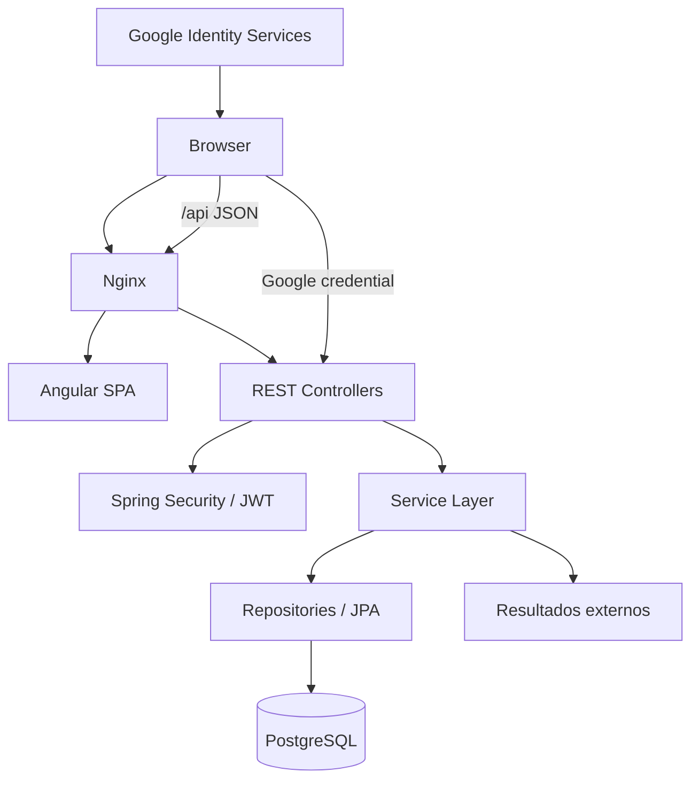
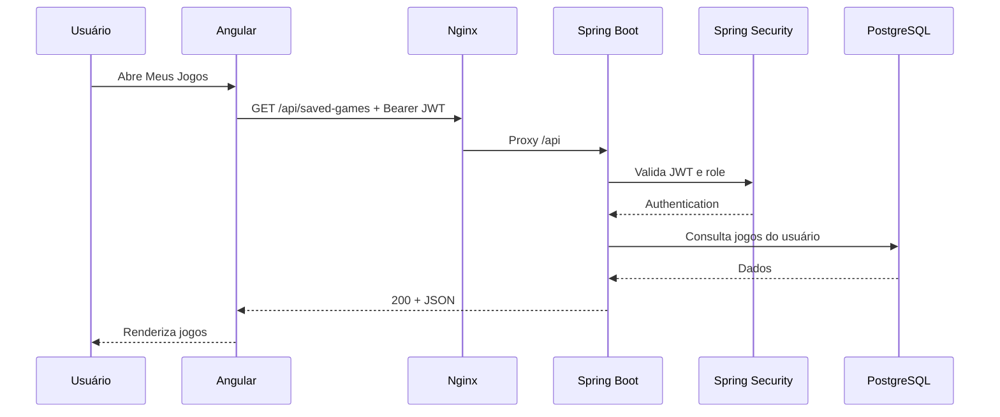

# Arquitetura do SorteLoto

## 1. Visão geral

O SorteLoto é uma aplicação **cliente-servidor** organizada em camadas. O frontend Angular é um SPA servido pelo Nginx. Requisições cujo caminho começa por `/api` são encaminhadas pelo Nginx ao backend Spring Boot. O backend expõe recursos seguindo o estilo **REST**, processa autenticação/autorização, executa regras de negócio e acessa o PostgreSQL por meio do Spring Data JPA.

## 2. Estilo REST

A API usa HTTP como protocolo de aplicação e JSON como representação. Controllers são agrupados por recursos, por exemplo `auth`, `draws`, `saved-games`, `stats` e `import`. Métodos HTTP expressam operações como leitura (`GET`), criação (`POST`), alteração parcial (`PATCH`) e exclusão (`DELETE`).

A aplicação não pretende ser uma implementação acadêmica de REST nível máximo de maturidade/HATEOAS; ela usa **RESTful HTTP APIs pragmáticas**, adequadas ao frontend SPA.

## 3. Backend

### Controllers

Recebem parâmetros HTTP, DTOs e delegam o processamento para Services. Controllers não acessam diretamente o banco.

### Services

Concentram regras de negócio: geração, análise, SmartScore, autenticação, ranking, sincronização e leitura do histórico.

### Repositories

Interfaces Spring Data JPA encapsulam acesso ao PostgreSQL.

### DTOs

Definem contratos de entrada e saída da API e evitam expor entidades JPA diretamente como contrato público.

## 4. Segurança

O cadastro local usa BCrypt. Após autenticação, o backend emite um JWT contendo subject (e-mail), ID e role do usuário. O `JwtAuthenticationFilter` valida o token Bearer em requisições protegidas e monta o contexto do Spring Security.

O login Google é opcional. O frontend obtém uma credencial do Google Identity Services e envia o token ao backend, que valida audiência e identidade antes de emitir o JWT interno do SorteLoto.

Administração é protegida por role `ADMIN`.

## 5. Persistência

PostgreSQL armazena usuários, concursos, jogos gerados/salvos e estado da sincronização. A versão atual usa `ddl-auto=update` para facilitar desenvolvimento. Para produção, a recomendação é adotar migrations versionadas.

## 6. Infraestrutura Docker

O `docker-compose.yml` define:

1. `postgres`: PostgreSQL 16 com volume persistente;
2. `backend`: aplicação Spring Boot;
3. `frontend`: build Angular servido pelo Nginx.

O PostgreSQL só é acessado internamente pelos containers. O usuário expõe apenas o frontend na porta `8088`; o backend é alcançado pelo reverse proxy do Nginx.

## 7. Fluxo de uma requisição autenticada

## 8. Trade-offs

- JWT simplifica escalabilidade stateless, mas exige estratégia de expiração/revogação em sistemas maiores.
- Docker Compose é excelente para desenvolvimento e demonstração, mas produção pode exigir serviços gerenciados/orquestração.
- A integração de concursos reduz trabalho manual, porém cria dependência de disponibilidade externa.
- `ddl-auto=update` acelera prototipação, mas migrations versionadas são superiores para ambientes controlados.
